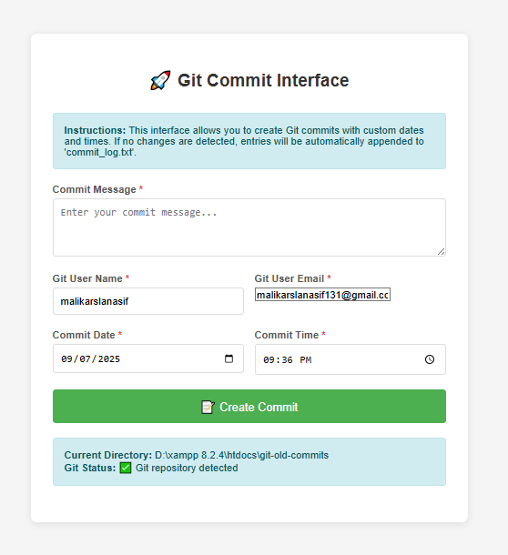

# 🚀 Git Commit Web Interface

A simple, user-friendly web-based interface for creating Git commits with custom dates and times. Perfect for backdating commits, historical documentation, or team collaboration scenarios.

## ✨ Features

- **Custom Date & Time**: Set any past, present, or future date/time for commits
- **Flexible User Identity**: Override Git author information per commit
- **Auto-Commit**: Automatically creates commit entries when no changes are detected
- **Single Log File**: Maintains all auto-generated commits in one organized log file
- **Security Built-in**: Secure shell command execution with proper input escaping
- **Responsive Design**: Works seamlessly on desktop and mobile devices
- **Zero Dependencies**: Pure PHP and HTML - no external frameworks required

## 🔧 Requirements

- **PHP** 7.0 or higher
- **Git** installed and accessible
- **Web Server** (Apache, Nginx, or local development server)
- **Git Repository** (existing or new)

---

## Demo Screenshots



---

## 📦 Installation

1. **Clone or Download**

   ```bash
   git clone https://github.com/malikarslanasif131/git-customize-date-author-commit-web-interface.git
   cd git-customize-date-author-commit-web-interface
   ```

2. **Configure Git Path** (if needed)

   Open `index.php` and adjust the Git path for your system:

   ```php
   // Windows (default)
   $gitPath = 'C:\\Program Files\\Git\\bin\\git.exe';

   // Linux/Mac
   $gitPath = 'git';
   ```

3. **Set Default User** (optional)

   Update default user credentials in `index.php`:

   ```php
   $gitUserName = 'your-name';
   $gitUserEmail = 'your-email@domain.com';
   ```

4. **Place in Git Repository**

   Copy `index.php` to your Git repository root directory.

5. **Start Web Server**

   ```bash
   # Using PHP built-in server
   php -S localhost:8000

   # Or use your preferred web server (Apache, Nginx, etc.)
   ```

## 🖥️ Usage

1. **Access the Interface**

   Open your browser and navigate to the script location (e.g., `http://localhost:8000`)

2. **Fill Out the Form**

   - **Commit Message**: Enter your commit description
   - **Git User Name**: Author name (pre-filled with defaults)
   - **Git User Email**: Author email (pre-filled with defaults)
   - **Commit Date**: Select any date using the date picker
   - **Commit Time**: Set specific time (24-hour format)

3. **Submit**

   Click "📝 Create Commit" and the interface will:

   - Stage existing changes (if any)
   - Create a log entry in `commit_log.txt` (if no changes exist)
   - Execute the Git commit with your custom date/time and author info
   - Display success/error messages

## 📋 How It Works

### With Existing Changes

If you have modified files in your repository, the interface will:

1. Stage all changes with `git add .`
2. Create a commit with your custom date/time and author info

### Without Changes (Auto-Commit)

If no changes are detected, the interface will:

1. Append a new entry to `commit_log.txt` with commit metadata
2. Stage the updated log file
3. Create the commit with your specifications

### Example Log Entry

```
==================================================
Commit created on: 2025-09-02 14:30:45
Commit message: Historical commit for project setup
Author: malikarslanasif <malikarslanasif131@gmail.com>
Timestamp: 1725311445 (2025-09-02 14:30:45 UTC)
==================================================
```

## 🛡️ Security Features

- **Input Validation**: Server-side validation for all form inputs
- **Shell Escaping**: All user inputs are properly escaped using `escapeshellarg()`
- **XSS Protection**: HTML output is escaped with `htmlspecialchars()`
- **Email Validation**: Built-in email format validation
- **Error Handling**: Comprehensive error handling for all scenarios

## 🔍 Troubleshooting

### Common Issues

**"Git is not installed or not found"**

- Verify Git installation: `git --version`
- Update `$gitPath` variable in the script
- Ensure Git is in your system PATH

**"Not a Git repository"**

- Run `git init` in your directory
- Ensure you're in the correct repository folder

**"No changes to commit" (before auto-commit feature)**

- The script will now automatically create log entries
- Manual solution: Make changes to files or create new files

**Permission Issues**

- Ensure web server has write permissions to the directory
- Check file permissions: `chmod 755 directory_name`

## 🤝 Contributing

1. Fork the repository
2. Create your feature branch (`git checkout -b feature/amazing-feature`)
3. Commit your changes (`git commit -m 'Add some amazing feature'`)
4. Push to the branch (`git push origin feature/amazing-feature`)
5. Open a Pull Request

## 📝 License

This project is open source and available under the [MIT License](LICENSE).

## 👨‍💻 Author

**Malik Arslan Asif**

- GitHub: [@malikarslanasif131](https://github.com/malikarslanasif131)
- LinkedIn: [@malikarslanasif131](https://www.linkedin.com/in/malikarslanasif131/)
- Email: malikarslanasif131@gmail.com

## ⭐ Support

If this project helped you, please consider giving it a star on GitHub!

For issues, questions, or suggestions, please open an issue on the [GitHub repository](https://github.com/malikarslanasif131/git-customize-date-author-commit-web-interface).

---

**Happy Committing!** 🎉
